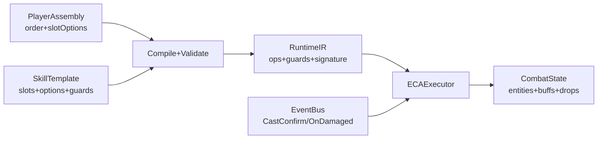

# 00 总览

## 目标
用 ECA（Event / Condition / Action）作为技能底层机制，在其上实现“玩家可自定义武器技能”的核心体验，但 **仅开放顺序重排**：
- 玩家只能在一个“技能模板”的固定槽位集合中 **调整执行顺序**、并在每个槽位的 **预置档位** 中选择（例如小/中/大范围）。
- 玩家 **不能新增/删除/改类型**（不能把 Condition 槽换成 Action 槽；不能把 Event 从 CastConfirm 改成 OnHit）。

本阶段仅做 **单机 PVE 验证**：用简易怪物体系、掉落与模拟器验证“顺序重排会带来玩法差异”，不考虑联机与 PVP。

## 非目标（本阶段不做）
- PVP、公平性匹配、反作弊对抗、回滚同步与延迟补偿
- 玩家上传脚本/可编程逻辑（避免安全与平衡爆炸）
- 复杂的技能表现与动画系统（本阶段只需能体验、能验证）

## 核心玩法闭环（PVE）
1. 玩家拥有一把武器（WeaponInstance），绑定一个 SkillTemplate 的 Assembly（顺序 + 档位）。
2. 玩家进入战场，自动/手动触发技能事件（本阶段可自动触发 CastConfirm）。
3. ECA 执行器根据“顺序 + 档位”生成不同的结算节奏与效果（命中率、爆发、控制链、风险）。
4. 击杀怪物获得材料（掉落表），用于后续打造（本阶段只做掉落验证）。

## 关键设计约束（必须）
- **可验证**：Assembly 在保存时必须通过静态校验（预算、限频、上限、禁用项），否则不可进入战斗。
- **可复现**：随机必须使用确定性 RNG（seed 派生），保证同一输入可复现结果（便于测试与回放）。
- **可控性**：高风险触发（OnHit/OnDamaged/OnTick）必须内置 ICD/Cap（本阶段 OnDamaged 模板已内置）。
- **性能守门**：生成物、AOE 查询、动作数必须有上限，避免顺序重排导致性能攻击。

## 术语
- **ECA**：Event（触发点）→ Condition（判定）→ Action（效果执行）。
- **Template（技能模板）**：固定 Event + 固定槽位集合；决定“可重排的积木集合”。
- **Slot（槽位）**：模板中的一个位置，类型固定（Condition/Target/Action/Timeline）。
- **Option（档位/预置模块）**：槽位可选的预置配置（例如范围 3/4，触发概率 20%/35%）。
- **Order（顺序）**：玩家对槽位 id 的排列（仅重排，不改变集合）。
- **Assembly（组装）**：{ templateId, order, slotOptions }，编译后得到可运行 IR。
- **Guard（守门）**：模板级硬约束（ICD、每秒上限、最大生成物等），玩家不可移除。

## 数据流概览

