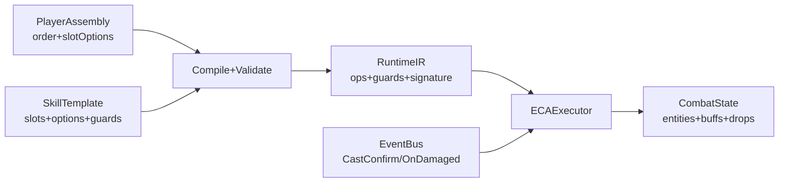

# 00 总览

## 设计参考
本项目的玩法界面操控模式与技能组装结构参考：
- **《Noita》**：魔杖系统、法术槽位顺序、充能/延迟/投射物参数、俯视角走位战斗
- **《魔法工艺》**：模块化法术构建、触发/效果/修饰组合、实时施法体验

## 目标
用 ECA（Event / Condition / Action）作为技能底层机制，在其上实现“玩家可自定义法术”的核心体验，参考上述两款游戏的模块化构建方式：
- 玩家在一个“法术模板”的固定模块集合中 **调整执行顺序**、并在每个模块的 **预置档位** 中选择（例如小/中/大范围、快/中/慢弹速）。
- 玩家 **不能新增/删除/改类型**（不能把 Condition 模块换成 Action 模块；不能把 Event 从 CastConfirm 改成 OnHit）。
- **关键差异**：与 Noita 的“同一法术可重复”不同，本设计采用“每个模块只能出现一次，但顺序可重排”，更接近《魔法工艺》的模块组合逻辑。

本阶段仅做 **单机 PVE 验证**：用简易怪物体系、掉落与模拟器验证“顺序重排会带来玩法差异”，不考虑联机与 PVP。

## 非目标（本阶段不做）
- PVP、公平性匹配、反作弊对抗、回滚同步与延迟补偿
- 玩家上传脚本/可编程逻辑（避免安全与平衡爆炸）
- 复杂的技能表现与动画系统（本阶段只需能体验、能验证）

## 核心玩法闭环（PVE，参考 Noita/魔法工艺）
1. 玩家获得一把**随机武器**（WeaponInstance），绑定一个随机生成的 SkillTemplate 的 Assembly（顺序 + 档位）。
2. 编辑器展示**技能描述**（一句话概括能力）和 **ECA 拼装可视化**（模块类型和执行顺序）。
3. 玩家可以**调整顺序和档位**，编辑器实时更新技能描述，帮助理解变化。
4. 玩家进入战场，**手动瞄准+左键施法**（参考 Noita 的实时战斗，不是自动触发）。
5. ECA 执行器根据“顺序 + 档位”生成不同的结算节奏与效果（命中率、爆发、控制链、风险）。
6. 击杀怪物获得**法术模块碎片**（掉落表），用于后续**解锁新档位或新模板**（本阶段只做掉落验证）。
7. **每次刷新怪物时获得新的随机武器**，增加探索乐趣和重玩价值。

## 关键设计约束（必须）
- **可验证**：Assembly 在保存时必须通过静态校验（预算、限频、上限、禁用项），否则不可进入战斗。
- **可复现**：随机必须使用确定性 RNG（seed 派生），保证同一输入可复现结果（便于测试与回放）。
- **可控性**：高风险触发（OnHit/OnDamaged/OnTick）必须内置 ICD/Cap（本阶段 OnDamaged 模板已内置）。
- **性能守门**：生成物、AOE 查询、动作数必须有上限，避免顺序重排导致性能攻击。

## 术语（参考 Noita/魔法工艺）
- **ECA**：Event（触发点）→ Condition（判定）→ Action（效果执行）。
- **Template（法术模板）**：固定 Event + 固定模块集合；决定“可重排的积木集合”（类似 Noita 的魔杖类型）。
- **Slot（模块槽位）**：模板中的一个位置，类型固定（Condition/Target/Action/Timeline），类似《魔法工艺》的“触发/效果/修饰”模块。
- **Option（档位/预置模块）**：槽位可选的预置配置（例如范围 3/4，触发概率 20%/35%，弹速快/中/慢）。
- **Order（顺序）**：玩家对模块槽位 id 的排列（仅重排，不改变集合），类似 Noita 中调整法术顺序影响施法节奏。
- **Assembly（组装）**：{ templateId, order, slotOptions }，编译后得到可运行 IR（类似 Noita 的“魔杖配置”）。
- **Guard（守门）**：模板级硬约束（ICD、每秒上限、最大生成物等），玩家不可移除（类似 Noita 的魔杖固有属性）。

## 数据流概览

