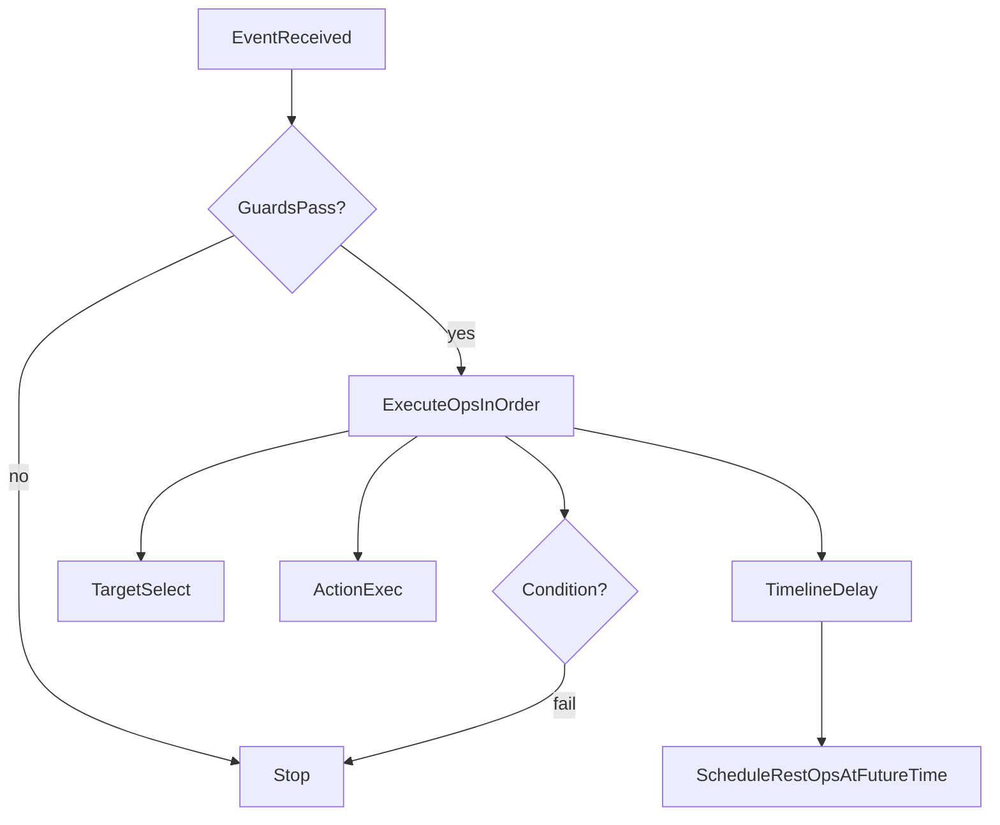

# 01 ECA 原子与执行模型

## 为什么用 ECA
- **可组合**：把“触发 / 判定 / 效果”拆成可组合单元。
- **可验证**：在进入战斗前做静态校验（预算、限频、上限、禁用项）。
- **可复现**：事件流 + seed 派生 RNG → 可重复得到同结果（便于调试/回放）。

本项目的关键点是：**玩家不直接编辑 ECA 图**，而是基于模板“重排顺序 + 切换档位”。因此运行时执行模型必须支持“线性顺序执行”，并且允许 Target/Timeline 出现在不同位置导致不同语义。

## 原子分类

### 1) Event（事件）
事件是执行入口。模板固定事件类型。

本阶段使用：
- `CastConfirm`：主动释放（可自动触发）。
- `OnDamaged`：受击触发（用于反击类模板，强制守门）。

事件上下文（EventContext）最小字段建议：
- `time`：当前毫秒时间（或帧号）。
- `casterId`：触发者实体。
- `rng`：本次事件的 RNG（由 seed+time 派生）。
- `targets?`：可选，被外部输入或 Target 原子填充的目标集合。

### 2) Condition（条件）
条件用于短路执行：失败则直接停止本条执行链。

本阶段最小条件集：
- 资源：`HasResource(mana/ammo >= x)`
- 距离：`InRange(max)`（如果尚未选目标，则视为通过；顺序差异由“TargetType”等条件体现）
- 目标类型：`TargetType(allow: monster/player)`
- 概率：`ProcChance(p)`（高风险触发的组成要素之一）

返回值：
- `ok:boolean`
- `failCode?:string`（用于 UI 提示/统计）

### 3) Target（目标选择）
将“空间查询与目标过滤”抽离成 Target 原子，生成 `ctx.targets`：

本阶段最小目标集：
- `singleNearest`：最近敌人单体
- `cone(range,max)`：扇形（简化为距离过滤 + 取前 N）
- `circle(radius,max)`：圆形（简化为距离过滤 + 取前 N）

说明：目前为简化模拟，目标选择不含方向/遮挡；后续可扩展为真正的几何判断。

### 4) Action（动作）
动作对世界状态产生影响。

本阶段最小动作集（示例）：
- 伤害：`Damage(formula)` / `SpawnProjectile(formula)`（当前实现同一化为直接伤害）
- 状态：`Debuff(kind,power,durationMs)`（例如 slow/silence）
- 位移：`Dash(distance)`（本阶段只改变 x 轴位置）
- 地面持续：`SpawnAreaDoT(tickFormula)`（当前实现为一次 tick，后续可扩展周期 tick）
- 标记：`Mark(tag)` 与 `MarkReward(requiredTag,reward)`（用于击杀掉落加成验证）

动作必须声明：
- 读写集合（设计层面）：读哪些属性、写哪些属性（用于审计与优化）
- 预算成本（budget hint）：用于静态预算校验

### 5) Timeline（时序）
Timeline 是“延迟执行门”。当执行到 Timeline 时：
- 将“后续 ops”整体延迟 `delayMs` 后继续执行
- 重要：延迟后执行时的 `ctx.time` 应推进（用于 debuff 过期等）

### 6) Formula（公式）
本阶段公式简化为线性：
- `damage = atk * scale + flat - target.defense`

后续可扩展为表达式 DSL，但必须：
- 可静态分析（上限/下限、变量白名单）
- 可复现（不允许非确定性）

## 执行模型（线性 ops）
编译后的 IR 表示为 `ops[]`，每个 op 为 `Condition|Target|Action|Timeline`。

执行伪流程：
1. Guard 检查（ICD/每秒触发上限）
2. 从 `ops[0]` 顺序执行：
   - Condition：失败则停止
   - Target：写入 `ctx.targets`
   - Action：对 world/state 生效
   - Timeline：调度“剩余 ops”在未来执行，然后停止当前执行（避免重复）

## 顺序重排带来的语义差异（设计重点）
同一组槽位，顺序不同可导致：
- **先 Target 再 InRange**：距离条件变成“对选中目标校验”
- **先 InRange 再 Target**：距离条件可能“无目标时直接通过”，实际由 Target 决定命中面（更偏“无锁定”）
- **Timeline 前置**：形成蓄力/延迟爆发；Timeline 后置则更像后摇
- **Debuff 前置**：先控后打，提高命中（收益更稳定但预算可能更高）
- **Damage 前置**：先打后控，更偏爆发但命中/追击不稳定

因此：模板设计时要刻意提供“可重排但仍有意义”的槽位集合。

