# 04 运行时架构

## 组件划分
运行时以“事件驱动 + 线性 ops 执行”为核心，建议组件如下：
- **Compiler**：Template + Assembly → RuntimeIR（ops + guards + budgets + signature）
- **Validator**：预算校验、顺序合法性、必需 guards、禁用项
- **EventBus**：事件订阅与分发（CastConfirm / OnDamaged…）
- **Executor**：执行 RuntimeIR（顺序执行 Condition/Target/Action/Timeline）
- **Scheduler**：处理 Timeline 延迟，将“剩余 ops”排入队列
- **CombatState**：实体属性、位置、标签/状态、掉落、战斗日志
- **ActionLog**：记录关键动作（伤害、死亡、掉落）用于统计/回放（本阶段为最小实现）
- **PresentationEvents（建议新增）**：执行过程产生“表现事件”（不影响判定），供表现层消费（见 `07_表现层与手感设计.md`）

## 数据结构（建议）
- `RuntimeIR`
  - `templateId`
  - `event`
  - `guards`
  - `ops[]`
  - `budgets`
  - `signature`
- `CombatState`
  - `entities{ id -> entity }`
  - `queue[]`（延迟任务）
  - `pendingDeaths[]`
  - `drops[]`
  - `skillRuntime{ templateId -> runtimeState }`（记录 ICD/Cap 的窗口）

## 执行流程

```mermaid
sequenceDiagram
  participant Bus as EventBus
  participant Exec as Executor
  participant State as CombatState
  participant Sch as Scheduler

  Bus->>Exec: emit(event, ctx)
  Exec->>State: guardsPass(runtimeState, guards, ctx.time)
  alt guardsFail
    Exec-->>Bus: stop
  else guardsOk
    loop opsInOrder
      Exec->>Exec: Condition.eval(ctx,state)
      Exec->>Exec: Target.select(ctx,state)
      Exec->>State: Action.exec(ctx,state)
      alt Timeline
        Exec->>Sch: schedule(restOps, ctx.time + delay)
        Sch->>State: queue.push(task)
        Exec-->>Bus: stopCurrentRun
      end
    end
  end
```

## Scheduler（时间线）策略
最小策略：维护 `queue[{at, fn}]`，主循环每 tick 执行 `at <= now` 的任务。

关键要求：
- 延迟执行时应推进 `ctx.time`（保证 debuff until 与统计一致）
- 防止队列爆炸：每实体/每技能/全局设置最大队列长度（PerfGuard）

## RNG（可复现）
- 统一从 seed 派生（例如 `seed = Hash(matchSeed, time, templateId, eventOrdinal)`）
- 禁止使用系统随机源
- 同一事件的概率判定（ProcChance）应使用事件上下文 `ctx.rng`

## 统计与回放（本阶段最小）
本阶段只要求：
- 战斗日志：伤害、死亡、掉落
- 输出指标：剩余怪物数、掉落列表、玩家剩余 HP

后续扩展方向：
- 记录事件序列（EventLog）+ 输入 + seed，可回放
- 记录每次 Rule/Op 执行次数，用于平衡与反异常

## 与当前代码的对应关系（实现落点）
- `engine/runtime.js`：EventBus、compileAssembly、executeAssembly、Scheduler/Queue
- `engine/ops.js`：buildOp（将 SlotOption 转为运行时 op，并提供 eval/exec/select）
- `engine/budget.js`：预算聚合与 cap 校验
- `engine/rng.js`：确定性 RNG 与概率判定

## 表现层对接点（设计补充）
建议在 Executor 的关键点抛出“表现事件”，但不影响判定：
- `OnCastWindupStart`：开始前摇（显示指示器、播放施法动作）
- `OnCastRelease`：释放帧（生成投射物表现）
- `OnProjectileSpawn`：投射物生成（飞行轨迹）
- `OnHitConfirmed`：命中确认（命中闪光/音效/飘字）
- `OnMonsterTelegraphStart`：怪物攻击预警开始

这些事件的参数必须可从 RuntimeIR/ctx/state 推导，避免表现与判定参数不一致。

